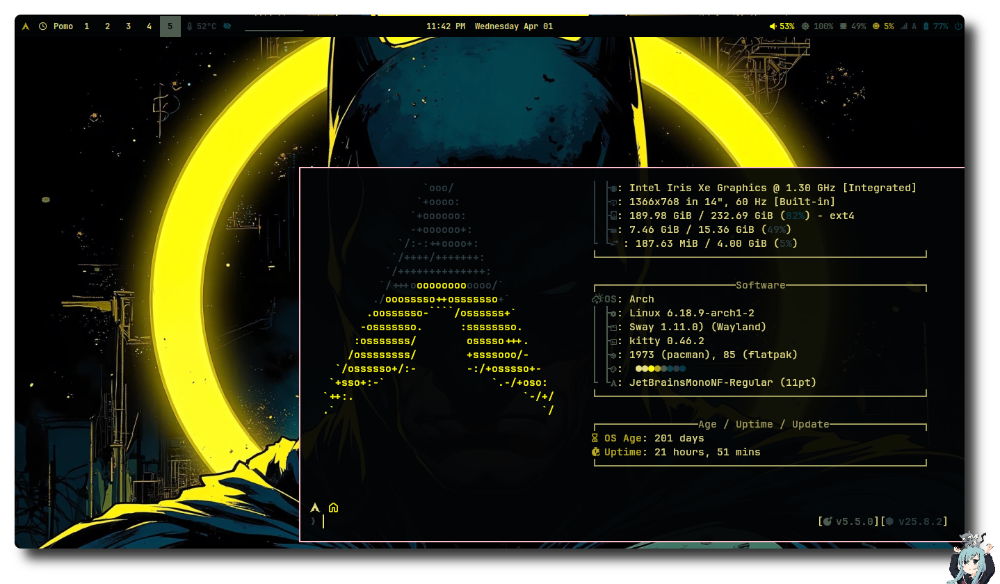
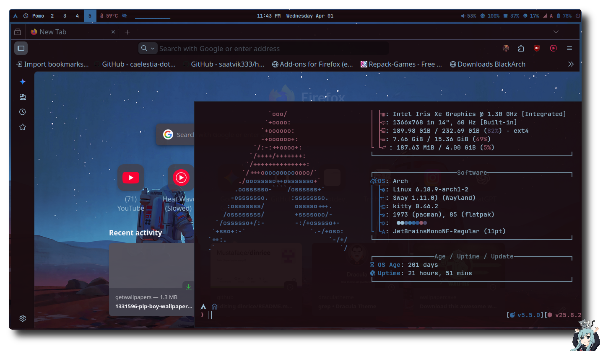
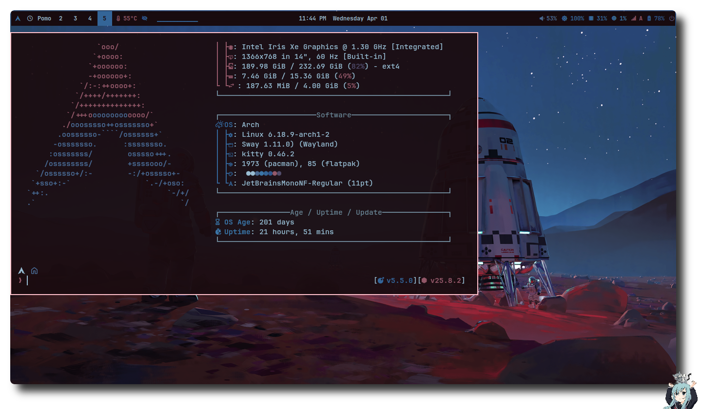
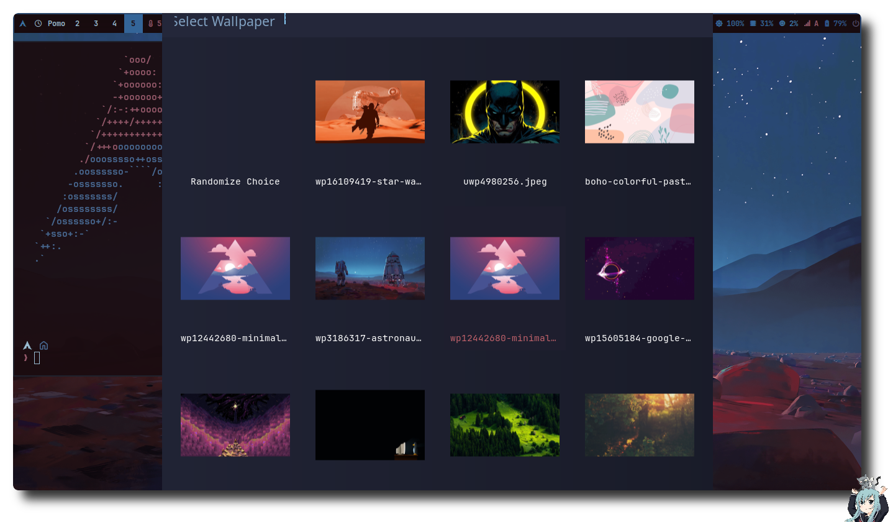

# Din Rice - Sway Desktop Environment

A beautiful, dynamic Sway window manager configuration integrating Pywal, Waybar, and Rofi with dynamic textures (CRT scanlines, glass blur) depending on your wallpaper selection in real-time!

## Themes in Action






> **Special Thanks:** I was heavily inspired by the [Ruixi-rebirth/sway-dotfiles](https://github.com/Ruixi-rebirth/sway-dotfiles.git) repository. Thank you for the inspiration!

##  Installation

To install this rice safely without destroying your current setup:

1. **Backup your existing configurations:**
   ```bash
   mv ~/.config/sway ~/.config/sway_bak
   mv ~/.config/waybar ~/.config/waybar_bak
   mv ~/.config/rofi ~/.config/rofi_bak
   ```

2. **Clone the repository and copy the configurations:**
   ```bash
   git clone https://github.com/Mustafaqe/dinrice.git /tmp/dinrice
   cp -r /tmp/dinrice/.config/* ~/.config/
   ```

3. **Reload Sway:**
   Press `Mod + Shift + c`. Waybar and Rofi will automatically boot up with the new configurations.

##  How to Add Your Own Wallpapers & Trigger Textures

Adding your own wallpaper is incredibly simple. This rice contains a custom dynamic engine built into `set_wallpaper.sh` that automatically themes Waybar and Rofi based on **keywords in your wallpaper filename**!

1. **Add your wallpapers:**
   Place any new `.png`, `.jpg`, or `.webp` inside the wallpaper directory:
   `~/.config/sway/wallpaper/`

2. **Trigger Dynamic Textures via Filename:**
   - **CRT Scanline Mode:** If you rename your wallpaper file to include the word `crt` anywhere in the filename (e.g., `synth_crt.png`), Waybar and Rofi will automatically drop opacity and apply a retro CSS CRT scanline effect!
   - **Glass / Blur Mode:** If you rename your wallpaper to include the words `glass` or `blur` (e.g., `mountains_blur.jpg`), the components will become highly translucent, mimicking a frosted glass blur.
   - **Default UI:** If neither word is found, menus will fall back to beautiful, opaque colors matched perfectly to the image using Pywal.
   
3. **Change the Wallpaper:**
   Press your bound shortcut (likely `Alt + Space` or through your Rofi menu) to open the Wallpaper selector and pick your new image. All system colors and menu textures will shift simultaneously!


## Dependencies

Make sure you have the following packages installed to get the best out of this rice:
- **Core WM**: `sway`, `swaybg`, `waybar`, `rofi` (wayland fork), `kitty`
- **Dynamic Theming**: `pywal`
- **Notifications & UI**: `mako`, `nm-applet`, `fcitx5`
- **Screenshots**: `grim`, `slurp`, `wl-clipboard`, `imagemagick` (for the script watermark)
- **Media & Backlight**: `light`, `playerctl`, `pulseaudio` (or `pipewire-pulse` for `pactl`)
- **Idle Control**: `swayidle`, `swaylock`

## Keyboard Shortcuts

Here are the main keybindings configured in `config`. (_Note: `Mod` refers to the `Alt` key._)

### Workspaces & Navigation
- `Mod + [1-0]`: Switch to workspaces 1 through 10
- `Mod + Arrow Keys` (or `h/j/k/l`): Move focus between windows
- `Mod + Shift + [1-0]`: Move focused window to workspace
- `Mod + Shift + Arrow Keys`: Move focused window
- `Mod + , / .`: Prev/Next Workspace
- `Mod + /`: Back and Forth Workspace

### Desktop Actions
- `Mod + Return`: Open Terminal (`kitty`)
- `Mod + Shift + Return`: Floating Terminal
- `Super` (Windows Key): Open Application Launcher (`rofi`)
- `Mod + Super`: Open Power Menu (`rofi`)
- `Mod + Space`: Open Wallpaper Selector
- `Mod + Shift + Space`: Toggle Floating Mode
- `Mod + Shift + c`: Reload Sway settings
- `Mod + Shift + e`: Exit Sway Session
- `Mod + Shift + p`: Kill Focused Window
- `Mod + o`: Toggle Waybar visibility
- `Mod + f`: Toggle Fullscreen

### Layouts & Scratchpad
- `Mod + s / w / e`: Change layout to Stacking, Tabbed, or Split
- `Mod + g / Shift + g`: Remove / Reset outer and inner gaps
- `Mod + - / =`: Move to scratchpad / Show scratchpad
- `Mod + r`: Enter Resize Mode (then use arrows/hjkl, Return/Esc to exit)

### Screenshots
- `PrintScreen`: Fullscreen Screenshot
- `Shift + PrintScreen`: Area Screenshot
- `Mod + [`: Area Screenshot (save only)
- `Mod + ]`: Area Screenshot (copy to clipboard)
- `Mod + a`: Area Screenshot (with styled watermark via imagemagick script)

### Apps & Media
- `Mod + b`: Firefox
- `Mod + m`: Netease Cloud Music
- `Mod + t`: Telegram Desktop
- `Mod + q`: Icalingua
- `Volume / Brightness Keys`: Media, internal volume (`pactl`), and brightness (`light`) adjustments
